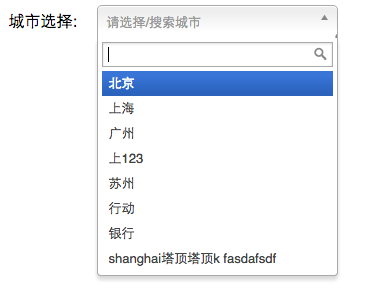

# chosen4chinese
chosen4chinese 是在[chosen](https://github.com/harvesthq/chosen)的基础上专门针对中文的改进。

## 改进点
1. 增加对中文拼音、及拼音多音字的搜索，如下例子所示:  


2. 移动端可配置

## 使用方式
1. 引入jquery和chosen4chinese:
```
<script src="jquery-1.8.2.min.js"></script>
<script src="chosen.jquery.min.js"></script>
```
2. 在select的元素里添加chosen-select，并js中添加如下代码:
```
 $('.chosen-select').chosen({
        no_results_text: "没找到匹配条件!",
        max_selected_options: 5,
        disable_search_threshold: 5,      // 少于这个数则不显示搜索框
        search_contains: true
    });
```
## 详细例子
请参考example/index.html里的例子

## Bug List
1. 多音字的搜索bug \[已经修复，2015-10-22]
2. 空格引起的搜索bug

## 当前版本
1.0.0

## 开始日期
2015-10-17

## 更新日期
2015-10-22
